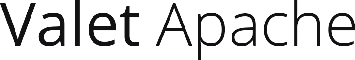

## Introduction

Valet Apache is a development environment for macOS. No Vagrant, no Docker, no `/etc/hosts` file.
This Valet version is using Apache instead of Nginx.

Go here for the [valet+ documentation](https://github.com/weprovide/valet-plus/wiki).

## Credits

This project is a fork of [laravel/valet](https://github.com/laravel/valet) and [weprovide/valet-plus](https://github.com/weprovide/valet-plus). Thanks to all of the contributors, especially the original authors:

- Taylor Otwell ([@taylorotwell](https://github.com/taylorotwell))
- Adam Wathan ([@adamwathan](https://github.com/adamwathan))

and the Valet+ authors:

- Tim Neutkens ([@timneutkens](https://github.com/timneutkens))
- Sam Granger ([@samgranger](https://github.com/samgranger))
